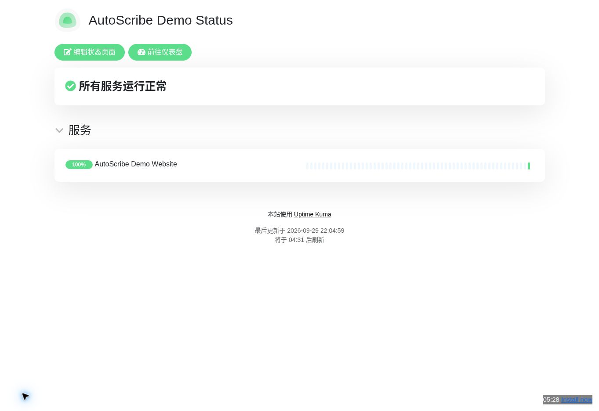

# AutoScribeAI

[English](README.md) | [简体中文](README.zh-CN.md) | [日本語](README.ja-JP.md) | [한국어](README.ko-KR.md)

## Turn real software usage into evidence-backed visual manuals

Give an AI a project, an accessible test environment, and the workflows you want documented. AutoScribeAI guides the AI to inspect the project, operate authorized interfaces, capture real screenshots, preserve evidence, and generate a manual that users can actually follow.

**One workflow can produce an offline HTML manual, editable Word document, and Markdown package. English is the default output language, with built-in templates for Simplified Chinese, Japanese, and Korean.**

[View real samples](tests/manual_samples/README.md) · [Get started](#get-started) · [Installation guide](docs/INSTALLATION.md)

### A real end-to-end example

The Uptime Kuma sample was created from a real temporary demo instance. It covers creating an HTTP monitor, saving and associating a notification configuration, and publishing a status page.



[Open the full sample](tests/manual_samples/uptime-kuma/README.md) · [Download Word](tests/manual_samples/uptime-kuma/output/manual.docx) · [Download Markdown package](tests/manual_samples/uptime-kuma/output/manual-markdown.zip)

The sample intentionally preserves its limits: the webhook uses a placeholder endpoint, message delivery was not tested, and the temporary demo deployment was not pinned to a source commit.

## What you get

| Deliverable | Best for |
| --- | --- |
| **Offline HTML manual** | Searchable, browsable documentation with screenshots, local assets, and links to other export formats |
| **Word document** | Editing, customer delivery, training material, and formal handoff |
| **Markdown ZIP** | Project docs, Git repositories, knowledge bases, static documentation systems |
| **Coverage & quality report** | Seeing exactly which workflows were verified, blocked, unverified, or still pending |

The content model is evidence-first: source-code inference can suggest workflows, but only real observed steps with actual results and screenshot evidence may be marked as verified.

## Why AutoScribeAI is different

AutoScribeAI is not a hosted SaaS and does not require a long-running backend service. It is a portable **Skill Pack + deterministic local scripts** workflow.

The five skills divide the work:

- **autoscribe-orchestrator** — plans, starts, resumes, and coordinates a run.
- **autoscribe-project-analyzer** — maps modules, features, roles, and candidate workflows.
- **autoscribe-software-explorer** — performs authorized UI exploration and captures evidence.
- **autoscribe-manual-writer** — turns evidence into the structured manual model.
- **autoscribe-manual-verifier** — checks provenance, references, coverage, and delivery quality.

The AI host supplies browser/computer-use capability when real UI interaction is needed. AutoScribeAI supplies the workflow contract, schemas, evidence rules, renderers, and resumable state.

## Output architecture

```text
Project / UI exploration
        ↓
      Evidence
        ↓
    manual.json   ← single source of truth
        ↓
 ┌──────┼──────────────┐
 ↓      ↓              ↓
HTML   DOCX       Markdown ZIP
```

HTML is the primary reading experience. `manual.json` remains the canonical content model, so DOCX and Markdown are rendered from the same structured source instead of being converted from each other.

## Supported languages

Built-in template labels currently support:

- English — `en-US` **(default)**
- Simplified Chinese — `zh-CN`
- Japanese — `ja-JP`
- Korean — `ko-KR`

If `language` is omitted from the project configuration, AutoScribeAI uses `en-US`. Other BCP-47 language codes may still be used for AI-authored content; fixed template labels fall back to English.

Product UI names such as menu items, buttons, and field labels should remain in their original form when that improves accuracy.

## Get started

### 1. Prepare the repository or portable Skill Pack

Install the Python 3.10+ dependencies:

```bash
python -m pip install -r requirements.txt
```

To create a portable package:

```bash
python scripts/package_skills.py --output dist/autoscribeai-skills.zip
```

Keep the full `AutoScribeAI/` directory. The skills depend on shared scripts, schemas, references, and assets.

### 2. Start with the orchestrator skill

Ask your AI host to read:

```text
skills/autoscribe-orchestrator/SKILL.md
```

For real screenshots, the host also needs an authorized browser or computer-use capability. Credentials should be supplied through the host's secure login mechanism, never written into AutoScribeAI configuration or manuals.

### 3. Describe the project and scope

Example:

> Use AutoScribeAI to create a complete user manual for this project. Source: [path or repository]. Test environment: [URL]. Role: [role]. Cover monitor creation, notification configuration, and status-page publishing. You may create synthetic test data in the test environment. Capture real screenshots, preserve unverified gaps, and export offline HTML, Word, and Markdown.

English is used when no output language is specified. To request another supported language, explicitly set `language` or state the target language in the task.

See [Installation](docs/INSTALLATION.md) for the CLI workflow and host requirements.

## Real sample projects

| Sample | Manual language | Verified scope | Open |
| --- | --- | --- | --- |
| **Uptime Kuma** | Simplified Chinese | Monitor, notification configuration, status page — 3/3 workflows; delivery not tested | [Manual & evidence](tests/manual_samples/uptime-kuma/README.md) |
| **changedetection.io** | Japanese | Public-page evidence; 0/3 functional workflows verified | [Manual & evidence](tests/manual_samples/changedetection/README.md) |
| **IT Tools** | Korean | JSON → YAML conversion — 1/3 workflows verified | [Manual & evidence](tests/manual_samples/it-tools/README.md) |

Each sample preserves its project configuration, evidence screenshots, structured manual, exports, coverage report, and limitations.

## Current status

Implemented today:

- portable five-skill bundle
- resumable file-based run state
- project inventory and immutable coverage plan
- evidence-backed workflow model
- screenshot evidence validation
- offline searchable HTML manuals
- DOCX export
- Markdown ZIP export
- chapter FAQ support with provenance rules
- English / Simplified Chinese / Japanese / Korean template localization
- real sample manuals with preserved limitations

Real browser interaction is intentionally delegated to the AI host instead of a bundled universal browser driver. With source code only, AutoScribeAI can map features and candidate workflows, but it will not pretend those workflows were executed.

## Documentation

| Resource | Purpose |
| --- | --- |
| [Installation](docs/INSTALLATION.md) | Install the Skill Pack and run the local tools |
| [Technical design](docs/TECHNICAL_DESIGN.md) | Architecture, skill boundaries, evidence model, exports |
| [Roadmap](docs/ROADMAP.md) | Completed work and remaining milestones |
| [Run protocol](references/RUN_PROTOCOL.md) | Resume safety and task-state rules |
| [Evidence rules](references/EVIDENCE.md) | Screenshot, provenance, redaction, and verification rules |

Found a missing screenshot or incorrect step? Open an [Issue](https://github.com/While-Shark/AutoScribeAI/issues) with the affected section, environment, and observed result. Remove passwords, tokens, and business-sensitive data before sharing.
