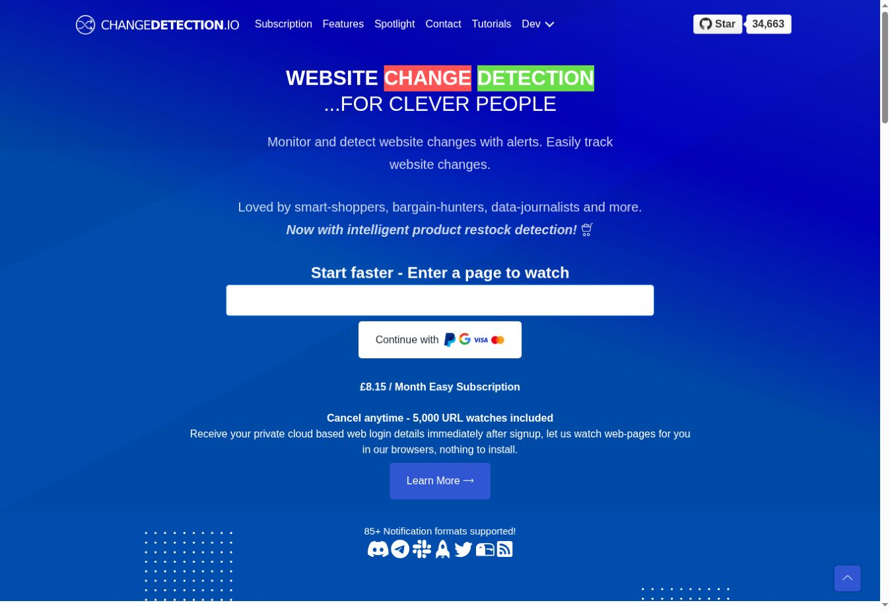

# changedetection.io ガイドサンプル

このサンプルは [commit 0e05667](https://github.com/dgtlmoon/changedetection.io/commit/0e0566721b1c483dcf7ae548210ee10532d9b181) に固定し、日本語で出力しています。監視対象の追加、監視範囲の選択、Browser Steps を扱います。上流ライセンス：Apache-2.0。

## 実際に開いた公式ページ

公式公開サイトのトップページで、監視 URL 入力欄と月額サブスクリプション案内を確認しました。登録や支払いは行っていません。この画面はセルフホスト版のウォッチ画面ではありません。

## エクスポート

- [オフライン HTML](output/index.html)
- [Word DOCX](output/manual.docx)
- [Markdown ZIP](output/manual-markdown.zip)
- [品質レポート](output/quality-report.json)
- [カバレッジ](output/coverage.json)

## 検証状態

3 つのワークフローは「未検証」です。スクリーンショットは公開ページの URL 欄とサブスクリプション案内を記録したもので、監視登録の実測結果ではありません。セルフホスト版をこの実行環境で起動できなかったため、登録・内容選択・Browser Steps は未検証です。品質レポートは `ready: false` です。

ソース一覧：[`inventory.json`](inventory.json)；生成設定：[`project.json`](project.json)；実行記録：[`run/manifest.json`](run/manifest.json)。
