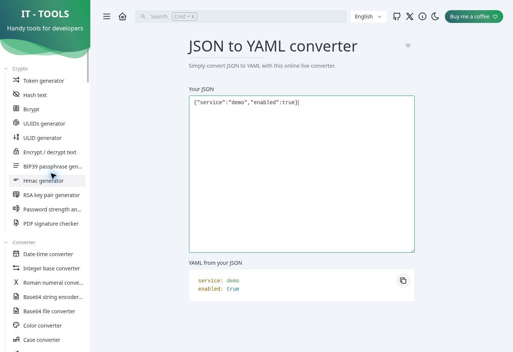

# IT Tools 안내서 샘플

이 샘플은 [commit d505845](https://github.com/CorentinTh/it-tools/commit/d505845f918e946ec300af7b36efc107e2f66e9e)에 고정하고 한국어로 출력했습니다. JSON→YAML 변환, 텍스트 해시, QR 코드 생성을 다룹니다. 상위 프로젝트 라이선스: GPL-3.0.

## 실제 JSON→YAML 작업 화면

합성 JSON `{"service":"demo","enabled":true}`를 입력해 YAML 출력이 표시되는 것을 공개 배포 페이지에서 확인했습니다.

## 내보내기

- [오프라인 HTML](output/index.html)
- [Word DOCX](output/manual.docx)
- [Markdown ZIP](output/manual-markdown.zip)
- [품질 보고서](output/quality-report.json)
- [커버리지](output/coverage.json)

## 검증 상태

JSON→YAML 워크플로는 실제 화면과 스크린샷으로 검증했습니다. 텍스트 해시와 QR 코드 워크플로는 소스 코드 후보이며 아직 화면에서 실행하지 않았습니다. 고정한 소스 commit과 공개 배포 버전은 일치 여부를 확인하지 못했으므로, 이 제한을 품질 보고서와 매뉴얼에 기록했습니다. 전체 3개 중 1개 흐름이 확인되어 `ready: false`입니다.

소스 목록: [`inventory.json`](inventory.json); 생성 설정: [`project.json`](project.json); 실행 기록: [`run/manifest.json`](run/manifest.json).
