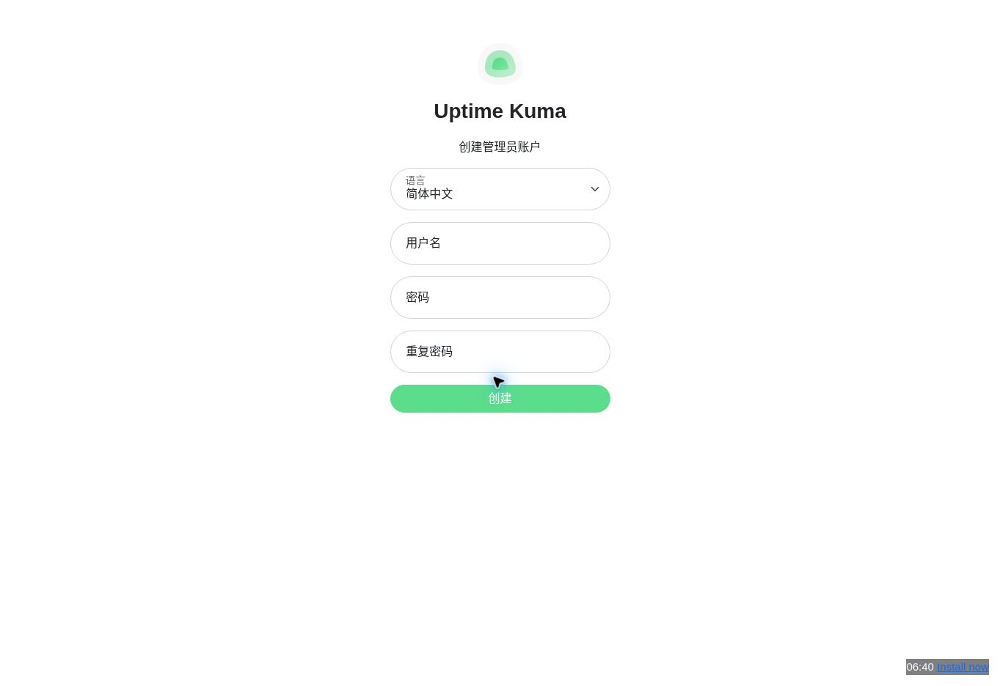

# Uptime Kuma 手册样例

本样例将 Uptime Kuma 固定在 [commit e7420f8](https://github.com/louislam/uptime-kuma/commit/e7420f8fa546a8baa7ac4bf9d10a32545d4346e0)，使用简体中文输出。源码候选内容涵盖 HTTP 监控配置、通知渠道和状态页。上游许可证：MIT。

## 首次启动截图

官方演示页面已到达“创建管理员账户”步骤，截图中凭据字段为空。为避免在公共演示中创建账号，没有继续登录或打开功能页面。这张图记录了实际启动界面，不作为三个功能流程的验证证据。

## 导出文件

- [离线 HTML](output/index.html)
- [Word DOCX](output/manual.docx)
- [Markdown ZIP](output/manual-markdown.zip)
- [质量报告](output/quality-report.json)
- [覆盖率](output/coverage.json)

## 验证状态

3 个功能流程仍为“未验证”；质量报告为 `ready: false`。截图只确认首次启动的建库与管理员账户页面，不代表监控或通知渠道配置已经实际操作。

源码清单：[`inventory.json`](inventory.json)；生成配置：[`project.json`](project.json)；运行记录：[`run/manifest.json`](run/manifest.json)。
