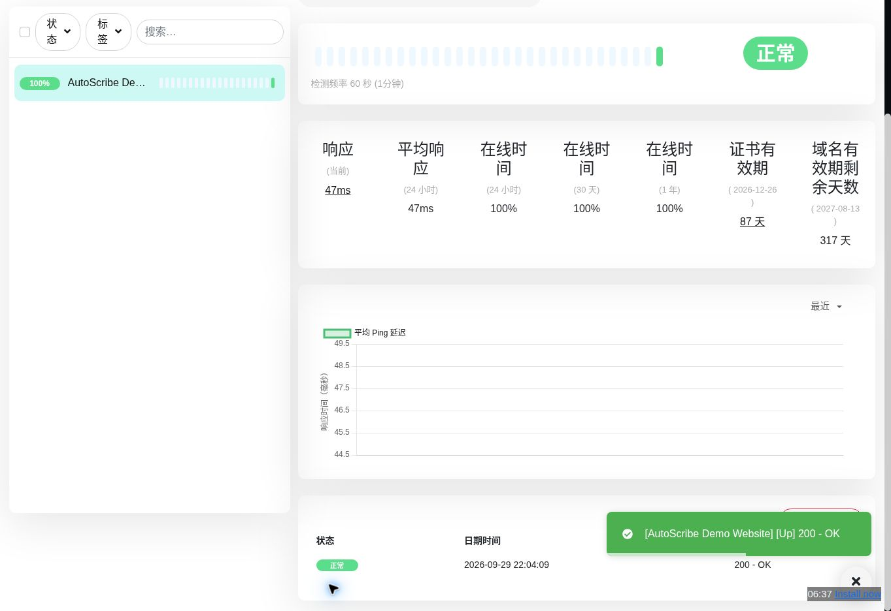
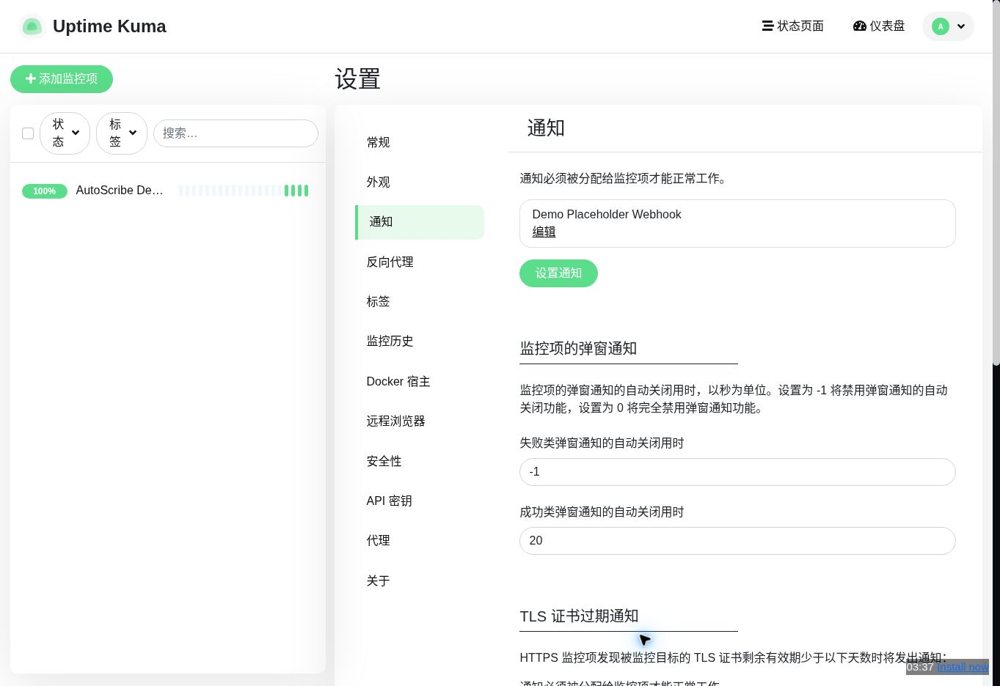
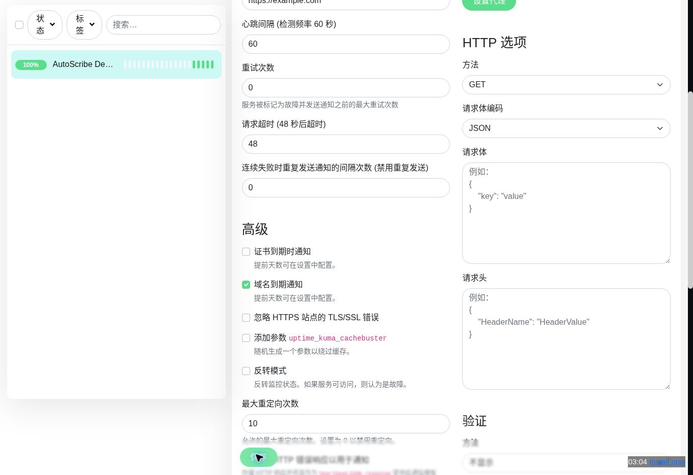

# Uptime Kuma 手册样例

本样例以 Uptime Kuma 固定源码提交 [e7420f8](https://github.com/louislam/uptime-kuma/commit/e7420f8fa546a8baa7ac4bf9d10a32545d4346e0) 为源码索引，并在官方短时演示实例 `demo.kuma.pet` 实际走通三项流程。演示站具体运行版本未单独核验，实例会自动过期。上游许可证：MIT。

## 实测截图

- HTTP 监控保存后显示正常，心跳为 HTTP 200：
- Webhook 占位渠道保存成功：
- 监控编辑页保存后的截图（关联勾选由当时的界面状态确认，截图未覆盖勾选区域）：
- 状态页公开展示测试监控：

通知配置使用 `example.invalid` 保留域作为 Post URL，未点击“测试”，没有实际投递告警。测试监控仅访问 `https://example.com`，所有名称均为合成数据。截图不包含密码或通知密钥。

## 导出文件

- [离线 HTML](output/index.html)
- [Word DOCX](output/manual.docx)
- [Markdown ZIP](output/manual-markdown.zip)
- [质量报告](output/quality-report.json)
- [覆盖率](output/coverage.json)

## 验证状态

监控、通知配置与状态页三个流程均有浏览器实测和截图，覆盖率为 3/3。质量报告仍标记 `ready: false`，原因是演示环境为临时实例、运行版本未与固定源码核实一致，并且没有验证 Webhook 消息投递。

源码清单：[`inventory.json`](inventory.json)；生成配置：[`project.json`](project.json)；运行记录：[`run/manifest.json`](run/manifest.json)。
